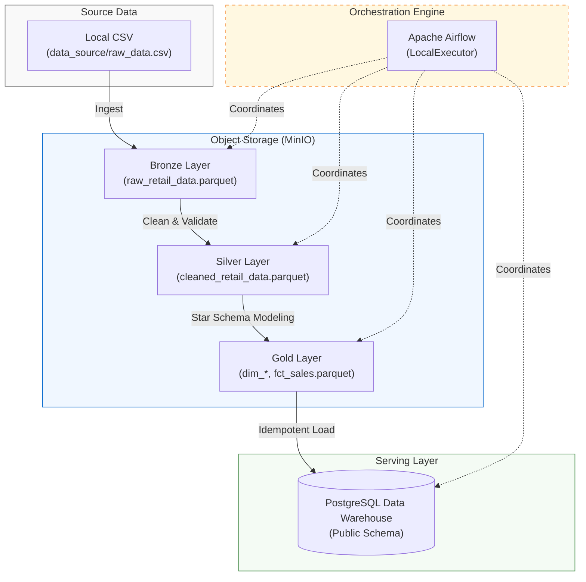
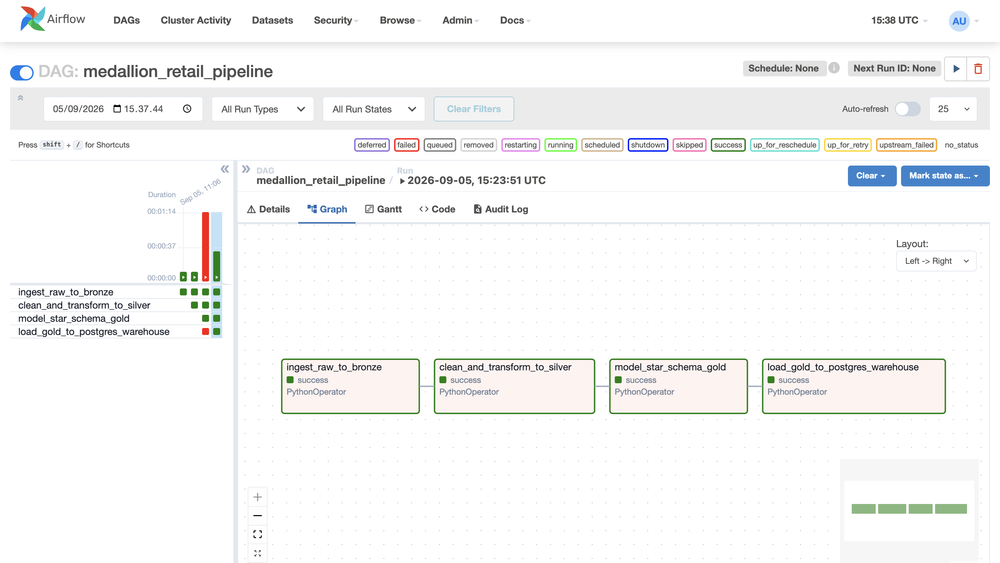
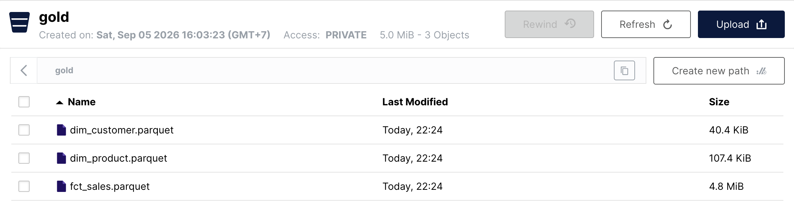
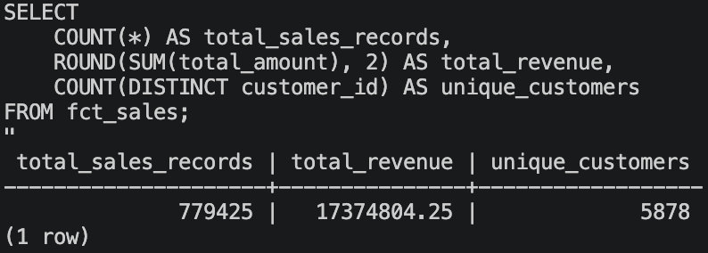

# Retail Medallion Data Pipeline (Airflow, MinIO, PostgreSQL)

An end-to-end data engineering pipeline designed to ingest, process, and model high-volume e-commerce transaction data using the Medallion Architecture (Bronze-Silver-Gold). The infrastructure is fully containerized via Docker Compose, utilizing Apache Airflow for DAG orchestration, MinIO as an S3-compatible object storage layer, and PostgreSQL as the analytical data warehouse.

---

## Architecture Overview



### Pipeline Execution Flow
1. **Bronze Layer (Raw Landing):**
   * Reads raw transactional records (`raw_data.csv`) directly from the local mount.
   * Converts data to column-oriented Apache Parquet using in-memory byte streams (`io.BytesIO`).
   * Landed into `s3://bronze/raw_retail_data.parquet` using Boto3 without intermediate disk overhead.

2. **Silver Layer (Quality & Conformance):**
   * Pulls Bronze Parquet objects for schema validation and data cleansing.
   * Filters out transaction cancellations (invoices prefixed with `C`).
   * Drops records with null business keys (`customer_id`, `description`).
   * Enforces business constraints (`quantity > 0` and `unit_price > 0`).
   * Performs deduplication and computes granular line metrics: `total_amount = quantity * unit_price`.
   * Pushes curated output to `s3://silver/cleaned_retail_data.parquet`.

3. **Gold Layer (Dimensional Modeling):**
   * Models clean transactional data into an optimized Star Schema:
     * **`dim_customer`**: `customer_id` (PK), `country`.
     * **`dim_product`**: `stock_code` (PK), `description`.
     * **`fct_sales`**: Transaction fact records linking foreign keys to dimensional tables.
   * Persists separate Parquet artifacts to `s3://gold/`.

4. **Serving Layer (PostgreSQL Data Warehouse):**
   * Retrieves dimensional artifacts directly from MinIO Gold.
   * Executes idempotent loads (`TRUNCATE` followed by chunked batch insertion via `psycopg2.extras.execute_values`) directly into the analytics warehouse.

---

## Tech Stack

* **Orchestration:** Apache Airflow 2.9 (LocalExecutor)
* **Object Storage / Data Lakehouse:** MinIO (S3 API compatible)
* **Data Warehouse:** PostgreSQL 15
* **Core Processing:** Python 3.10, Pandas, PyArrow, Boto3, Psycopg2
* **Infrastructure:** Docker & Docker Compose

---

## Repository Structure

```text
de-medallion-pipeline/
├── dags/
│   └── medallion_pipeline_dag.py   # Airflow DAG definition
├── data_source/                    # Raw source data (git-ignored)
├── docs/
│   └── images/                     # Pipeline execution verification assets
├── sql/
│   └── init_schema.sql             # PostgreSQL target table DDL
├── .env.example                    # Template for environment configuration
├── .gitignore
├── docker-compose.yaml             # Multi-service container orchestration
└── README.md
```

---

## Execution Verification

### 1. Airflow Pipeline DAG Run
Sequential dependency graph displaying successful end-to-end task completion:



### 2. MinIO Gold Lakehouse Objects
Dimensional model tables partitioned and persisted as Parquet files inside MinIO:



### 3. PostgreSQL Warehouse Aggregate Check
Verification query executed directly inside the target data warehouse container:



---

## Getting Started

### 1. Prerequisites
* Docker Desktop installed and active
* Git

### 2. Setup Environment
Clone repository and prepare environment files:
```bash
git clone https://github.com/<your-username>/de-medallion-pipeline.git
cd de-medallion-pipeline
cp .env.example .env
```

Ensure the source file is located at `data_source/raw_data.csv`.

### 3. Run Containers
Initialize the Airflow metadata database and start all services:
```bash
# Migrate Airflow metadata schema and generate admin user
docker compose run --rm airflow-webserver airflow db migrate
docker compose run --rm airflow-webserver airflow users create \
    --username admin --firstname Admin --lastname User \
    --role Admin --email admin@example.com --password admin

# Launch services in background mode
docker compose up -d
```

### 4. Configure Storage Buckets
Open MinIO Console at `http://localhost:9001` (Credentials: `minioadmin` / `minioadmin`) and create three target buckets:
* `bronze`
* `silver`
* `gold`

### 5. Execute Pipeline
1. Access Airflow UI at `http://localhost:8080` (Credentials: `admin` / `admin`).
2. Toggle the `medallion_retail_pipeline` DAG to **Active**.
3. Click **Trigger DAG** to run the complete data workflow.

---

## Data Warehouse Validation

Confirm row count and revenue aggregates directly within the PostgreSQL container:

```bash
docker compose exec warehouse-postgres psql -U airflow -d warehouse -c "
SELECT 
    COUNT(*) AS total_sales_records,
    ROUND(SUM(total_amount), 2) AS total_revenue,
    COUNT(DISTINCT customer_id) AS unique_customers
FROM fct_sales;
"
```

**Result Metrics:**
* Total Valid Sales Transactions: `779,425`
* Total Modeled Revenue: `17,374,804.25`
* Unique Customers: `5,878`

---

## Planned Improvements

* **Storage Partitioning:** Introduce date-partitioned folder layouts (`year=YYYY/month=MM/`) to reduce object scan overhead.
* **Incremental Ingestion:** Transition from batch full refresh to watermark/timestamp-based incremental upserts.
* **Data Quality Assertions:** Embed runtime data contracts using Great Expectations or Soda Core prior to database ingestion.